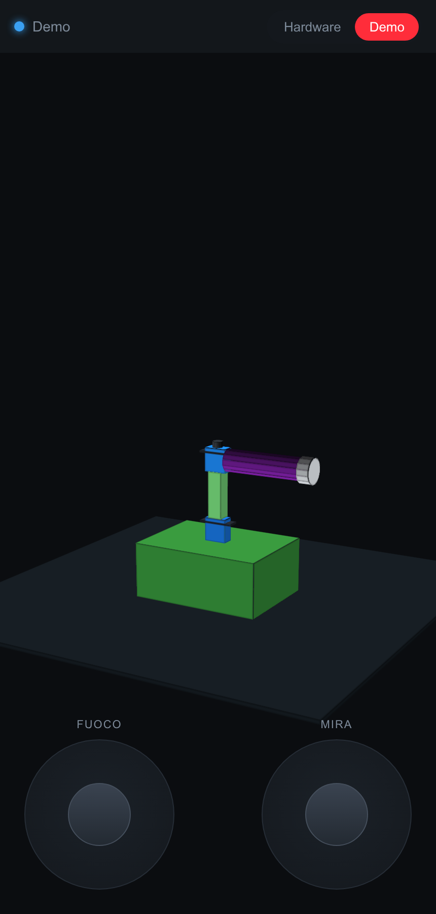
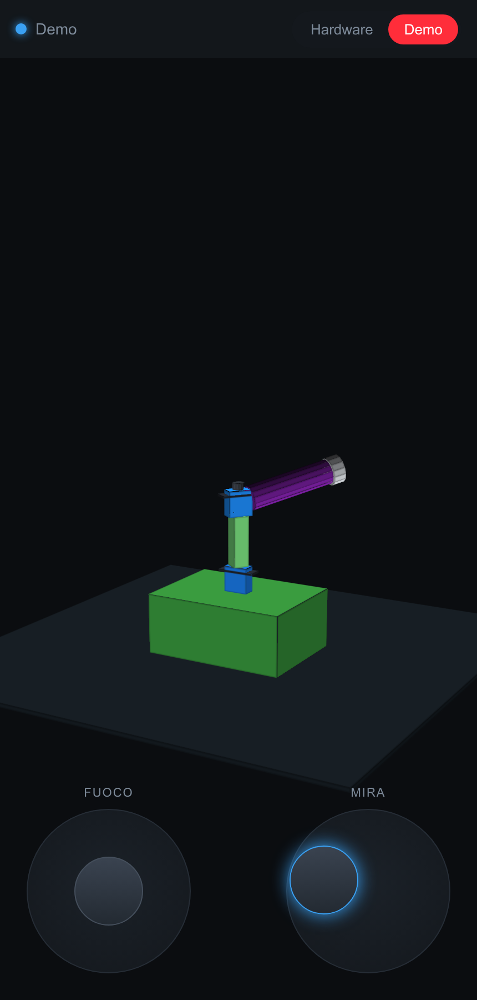
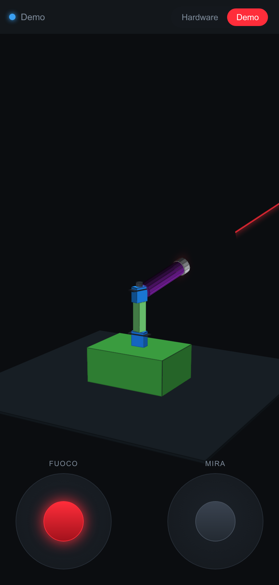

# Laser Gun - driver ESP

Questo è il driver per ESP8266 del progetto Laser Gun, un remix di
[Remotely controlled torch robot](http://www.thingiverse.com/thing:1598813) di JJRobots.
È un giocattolo automatico/telecomandato per far giocare te (o il tuo gatto) con un puntatore
laser. Una ESP8266 pilota i due servo motori pan/tilt e un relè per il laser, e serve da sola
il proprio pad di controllo web da smartphone (vedi [Pad di controllo web](#pad-di-controllo-web)
più sotto) — nessuna app o server esterno necessari. Un RTC può essere usato anche per
schedulare eventi automatici.


## Avviarlo su ESP NodeMCU

Per programmare la ESP, usa l'[Arduino IDE](https://www.arduino.cc/en/Main/Software), poi segui questi passi:

* Vai su **File** > **Preferenze**, e cambia l'URL del Board Manager con "http://arduino.esp8266.com/package_esp8266com_index.json", poi clicca OK
* Ora vai su **Strumenti** > **Board:Arduino one** > **Board Managers**
* Cerca "esp8266" e clicca Installa (ci vorrà un po')
* Dopo l'installazione torna su **Strumenti** > **Board:Arduino one** e clicca su **"NodeMCU 0.9 (ESP-12E Module)"**
* Installa le librerie extra richieste dallo sketch, tramite **Sketch** > **Include Library** > **Manage Libraries**: `ArduinoJson` (v5.x), `WiFiManager` (tzapu), `PubSubClient`, `RtcDS3231`, e [`WebSockets`](https://github.com/Links2004/arduinoWebSockets) (Links2004) — usata dal pad di controllo web
* Ora puoi collegarla e lanciare il caricamento

## Verifica di compilazione

Il firmware è stato compilato end-to-end con `arduino-cli` (core esp8266 3.1.2, tutte le librerie
sopra elencate) per la board NodeMCU: compila pulito, con margine comodo di memoria (RAM 42%,
flash 35%). Se aggiorni le librerie e qualcosa smette di compilare, controlla prima le versioni:
è lo scenario più comune di rottura su progetti Arduino datati.

## Hardware da costruire
La parte hardware è fatta da:

* x1 [ESP8266 NodeMCU](https://www.amazon.it/NodeMCU-Internet-delle-ESP8266-scheda-sviluppo/dp/B019PVI4IY)
* x2 [Servo motor 9g (SG90)](https://www.amazon.it/MINI-MICRO-SERVO-AEREI-ELICOTTERI/dp/B00CHJUG3I)
* x1 [RTC](https://www.amazon.it/WINGONEER-piccolo-AT24C32-precisione-orologio/dp/B01H5NAFUY)
* x1 relè digitale (per il trigger del laser, vedi sotto)

Ho usato un RTC per avere una temporizzazione reale e schedulare gli eventi, ma puoi anche usare
un RTC virtuale per simulare il timer (ovviamente non sarà preciso come un RTC vero, ma puoi
sincronizzarlo ogni giorno con un server remoto e sarà sufficiente).

[Qui la classe che ho scritto](https://raw.githubusercontent.com/tommy-codex/laser-gun-IoT/master/example/VirtualRTC.ino) ed ecco come usarla:
```
void setup(){
  //String TimeNow = YourCustomTimeService.getStringTime(); // nel caso tu abbia un servizio che fornisce questo formato data dd/mm/yyyy HH:mm:ss
  String TimeNow = "dd/mm/yyyy HH:mm:ss";
  String d =  TimeNow.substring(0,2);
  String h =  TimeNow.substring(3,5);
  String m =  TimeNow.substring(6,8);
  String s =  TimeNow.substring(9,11);
  rtc_timer = Rtc();
  rtc_timer.setup(d.toInt(), h.toInt(),m.toInt(),s.toInt());
}
void loop() {
  rtc_timer.loopTime();
  int seconds = rtc_timer.getSeconds();
  int minutes = rtc_timer.getMinutes();
  int hours = rtc_timer.getHours();
  int days = rtc_timer.getDays();
  // qui la userai
}
```

Ho rimosso i pin saldati solo per risparmiare spazio, ma credo si possa fare anche senza dissaldare,
basta forzare un po'. Usa questo schema (non so se è brutto, non sono un pittore :D) per costruire
l'hardware, ho fatto solo un elenco semplice dei punti di collegamento:
##### Servo X
* GND  -> GND
* Vcc  -> Vcc ( +5 )
* Sign -> D6

##### Servo Y
* GND  -> GND
* Vcc  -> Vcc ( +5 )
* Sign -> D5

##### RTC
* GND  -> GND
* Vcc  -> Vcc ( +3 )
* SDA -> D2
* SCL -> D1

##### Relè del laser
Non presente nello schema originale qui sotto — è la nuova aggiunta necessaria per sparare da
remoto. Usa un modulo relè digitale (opto-isolato, compatibile logica 5V), collega il lato bobina
alla ESP e i contatti NO (normalmente aperti) in parallelo al pulsante fisico del puntatore laser,
così chiudere il relè equivale a premere il pulsante con un dito.
* GND -> GND
* Vcc -> Vcc ( +5 )
* IN  -> D7
* Contatti COM/NO -> in parallelo ai terminali del pulsante del puntatore laser

##### Batteria
(non collegare contemporaneamente microUSB e batteria, non l'ho provato ma consiglio di non farlo)

* Positivo -> Vcc ( +5 )
* Negativo -> GND

##### Ecco lo schema elettrico


(questo schema disegnato a mano è precedente al relè del laser descritto sopra — il relè è
un'aggiunta semplice sul pin D7 libero, collegato come descritto nella sezione "Relè del laser")

##### Ecco il mio risultato


Poi metti tutto nella base, usa viti da 2/3 mm (non sono sicuro) per fissare la ESP alla base, e
tutto qui: programmala e divertiti.


## Pad di controllo web

La ESP serve da sola il proprio pad di controllo mobile, nessuna app o server esterno necessari:

1. Flasha lo sketch `Laser_Gun` come descritto sopra (assicurati che la libreria `WebSockets` sia installata).
2. Carica la cartella `WebUI/data` sul filesystem SPIFFS della ESP, usando il tool Arduino IDE
   ["Sketch Data Upload"](https://github.com/esp8266/arduino-esp8266fs-plugin) (puntalo alla cartella
   dello sketch `Laser_Gun` — il plugin cerca una cartella `data/` gemella, quindi usa direttamente
   `WebUI/data` come cartella dati dello sketch oppure copiala in `Laser_Gun/data`).
3. Accendi la pistola e collegati alla stessa rete WiFi configurata tramite WiFiManager (o al suo
   access point di fallback `LaserGUN-Enrico` se non è ancora stata configurata).
4. Dal telefono, apri `http://<indirizzo-ip-esp>/` nel browser.
5. Il pad si apre in modalità **Demo** di default (sicura, nessun hardware coinvolto) — un robot
   virtuale a schermo reagisce ai due stick. Passa a modalità **Hardware** per connetterti via
   WebSocket e pilotare i servo e il relè del laser reali:
   * Stick destro — mira: è un **controllo a velocità**, non a posizione assoluta. Deflettere lo
     stick muove i servo pan/tilt e continua a muoverli finché resta spostato (rilasciarlo ferma
     il movimento dov'è, non ricentra). Entrambi i servo sono normali SG90, quindi la corsa è
     limitata a un range sicuro 10°-170° ben dentro il limite meccanico di 180°, per non sforzare
     gli ingranaggi contro il finecorsa. La discesa del tilt è limitata ulteriormente (50° dal
     centro) per evitare che il tubo laser sbatta contro la base.
   * Stick sinistro — tieni premuto per sparare tramite il relè del laser, rilascia per fermarti

La stessa pagina si può aprire anche direttamente da `WebUI/data/index.html` (es. con un server
statico locale) per provare/mettere a punto la modalità Demo senza nessuna ESP collegata.

### Screenshot

| Demo a riposo | Mira in corso | Fuoco |
|---|---|---|
|  |  |  |

Il robot virtuale nella modalità Demo è un modello 3D vero (fatto solo con CSS 3D transform,
nessuna libreria esterna) che riproduce il montaggio reale: un servo alla base ruota tutto il
braccio in orizzontale (pan), un secondo servo montato sopra inclina il tubo laser in verticale
(tilt) — con gli stessi limiti di sicurezza usati dal firmware reale, così quello che vedi nella
demo è quello che succede sul robot vero.
